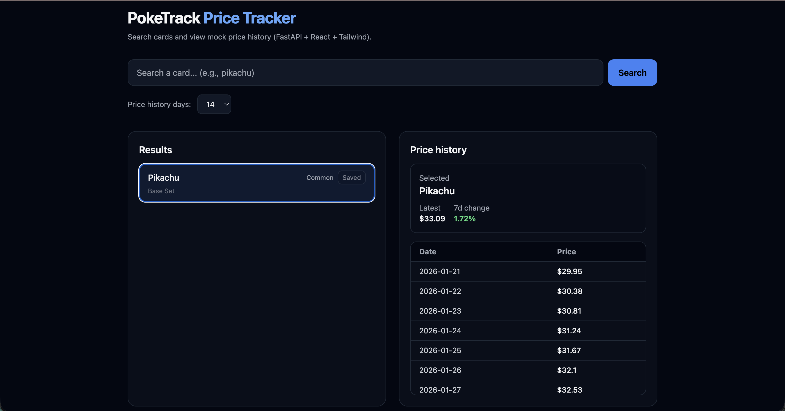
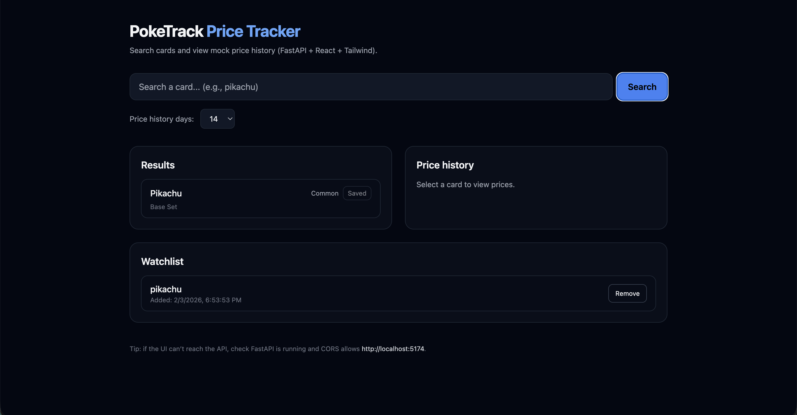

# 🃏 PokeTrack — Pokémon Card Price Tracker

PokeTrack is a full-stack web application that allows users to search Pokémon cards, view historical price trends, and save cards to a personal watchlist.

Built with **FastAPI**, **React**, **SQLite**, **SQLAlchemy**, and **Tailwind CSS**, this project demonstrates real-world full-stack development, REST APIs, database persistence, and frontend state management.

---

## 🚀 Features

- 🔍 Search Pokémon cards by name  
- 📈 View mock historical price data (7 / 14 / 30 days)  
- ⭐ Save cards to a persistent watchlist  
- ❌ Remove cards from watchlist  
- 🔄 Real-time UI updates synced with backend  
- 🌐 REST API built with FastAPI + SQLAlchemy  
- 🎨 Modern UI using React + Tailwind CSS  

---

## 🖼️ Demo

### 🔍 Card Search & Price History
Shows searching for a card, viewing historical prices, and adding it to the watchlist.



---

### ⭐ Watchlist Persistence
Demonstrates saved cards stored in the database and rendered in the UI after refresh.



---

## 🧠 Architecture Overview

### Frontend (React + Vite)
- `App.jsx` — Main UI, state management, API integration
- `lib/api.js` — Centralized API client for backend communication
- Tailwind CSS for styling
- Uses React hooks: `useState`, `useEffect`, `useMemo`

### Backend (FastAPI)
- RESTful API endpoints
- SQLAlchemy ORM for database models
- SQLite database for persistence
- Clean separation of routes, services, and schemas

### Database
**Table:** `watchlist`

| Field | Type |
|------|------|
| id | Integer (Primary Key) |
| card_name | String |
| created_at | Timestamp |

---

## 🔌 API Endpoints

| Method | Endpoint | Description |
|------|--------|------------|
| GET | `/cards/search?q=` | Search cards |
| GET | `/cards/{name}/price-history` | Price history |
| GET | `/watchlist` | Get saved cards |
| POST | `/watchlist` | Add card |
| DELETE | `/watchlist/{card_name}` | Remove card |

---

## 🛠️ Tech Stack

- **Frontend:** React, Vite, Tailwind CSS  
- **Backend:** FastAPI, SQLAlchemy  
- **Database:** SQLite  
- **API:** REST  
- **Version Control:** Git + GitHub  

---

## 📦 Setup Instructions

### Backend
```bash
cd app
uvicorn app.main:app --reload
